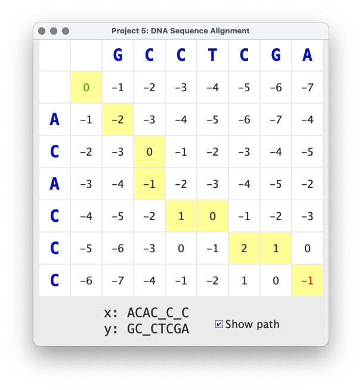

# Lab: DNA Sequence Alignment

## Overview

Sequence Alignment is an important technique in understanding the
similarity of two DNA sequences.  Applications of DNA sequence
alignment range from determining gene function to finding common
characteristics of different species. Informally, alignment can be
understood as writing the two sequences in rows, where two characters
in the same column are said to be aligned. If the two aligned
characters are the same, we have a match. If the two characters are
different, we have a mismatch.  To maximize the number of matches, we
can insert gaps in either sequence. Mismatches can be interpreted as
point mutations and gaps as insertion or deletion mutations. We
disallow columns that consist of gaps only.

There can be many alignments of two sequences. The scores assigned to
matches, mismatches, and gaps determine which are the best
alignments. Unless otherwise stated, a match is scored as +2, a
mismatch as -2, and a gap as -1.

An optimal solution can be found using the dynamic programming
approach described in lecture.  The cache constructed by the dynamic
programming algorithm can be visualized as a table whose entries
contain the best solution to each subproblem. The algorithm fills in
the entries of the table in row-major order with the best result for
every possible prefix of the alignment. More specifically, the entry
at row i and column j contains the score of the best match between the
first i characters of x and the first j characters of y.

**[Example]**



The image above shows the results of aligning `ACACCC` with `GCCTCGA`.
The best alignment has a score of -1, which corresponds to the entry
in the lower right corner of the cache. This score is computed by
summing the scores of each aligned pair of characters:

```
-2 + 2 + -1 + 2 + -1 + 2 + -1 + -2
```

The alignment can be written textually like this:

```
        A C A C _ C _ C
        : | . | . | . :
        G C _ C T C G A
```


## Tasks

**[YOUR TASK]** There are some tasks for you to complete in the `Judge` class. A Judge
encapsulates the costs associated with matches, mismatches, and
gaps. You will need to implement a method to score two aligned
characters and a method to score all characters in two aligned
strings.

**[Specifications]**
+ `public int score(char a, char b)`: Returns the score associated with the two characters, `a` and `b`.
    If `a` or `b` is a gap, return `gapCost`.
    Otherwise if `a` and `b` are equal, return `matchCost`;
    if they are not equal, return `mismatchCost`.
+ `public int score(String s1, String s2)`: Returns the score associated with the two strings, `s1` and `s2`.


The `Result` class is provided for you in its entirety, but you should
read the code carefully because you will need to store instances of
Result in your cache. A `Result` is a structure that holds a solution to
a subproblem. A solution consists of a score and a mutation that
indicates the last choice that was made.  The possible choices are M
(for match), I (for insertion in x), and D (for deletion in x, or
equivalently, for insertion in y). Because we ultimately wish to trace
back through the path of choices, we represent the mutation with a
`Direction`. We use `DIAGONAL` for M, `LEFT` for I, and `UP` for D. The
`mark` field in a `Result` is used to indicate whether or not the entry
appears in the optimal solution to the original alignment problem. The
GUI highlights marked cells when the user selects 'Show path'.

**[YOUR TASK]** Most of the work for this project involves implementing the
`TODO` methods in `SequenceAligner`. Write your own tests to guide your
development. Pay attention to the time bounds.

**[Specifications]**

+ `private void fillCache()`: Solves the alignment problem using the _bottom-up_
    dynamic programming algorithm described in lecture. The array `cache[i][j]`
    will hold the result of solving the alignment problem for the first `i` characters
    in string `x` and the first `j` characters in string `y`.
    Your algorithm must run in $O(n m)$ time, where n is the length of `x`
    and m is the length of `y`.
+ `public Result getResult(int i, int j)`: Returns the result of solving the alignment
    problem for the first `i` characters in `x` and the first `j` characters in `y`.
    The method should find the result in O(1) time by looking into the cache.
+ `private void traceback()`: Marks the path by tracing back through parent pointers, 
     starting with the lower right corner of the cache. Call `markPath()`
     on each `Result` along the path. The GUI will highlight all such marked cells
     when you check 'Show path'. As you're tracing back along the path, build
     the aligned strings in `alignedX` and `alignedY` (using `Constants.GAP_CHAR`
     to denote a gap in the strand).
     Your algorithm must run in $O(n + m)$ time, where n is the length of `x`
     and m is the length of `y`.

The `Driver` class will launch a GUI to help you visualize the
algorithm. Be sure to read the comments to see how you can modify the
nucleotides in the generated sequence to see how small changes to the
DNA strands affects the solution.


## Support code and submission

+ Student support code is at [link](https://github.com/IUDataStructuresCourse/dna-alignment-student-support-code).
  Please make sure to go through existing code, especially `Result.java` and the example tests
  in `StudentTest.java`, before you start.
+ Submit your code file `Judge.java` and `SequenceAligner.java` to
  [link](https://autograder.luddy.indiana.edu/web/project/926).
+ Submit your test file `StudentTest.java` to
  [link](https://autograder.luddy.indiana.edu/web/project/940).

-----------------

* This is the last lab of this semester. Good luck with the final exam!
